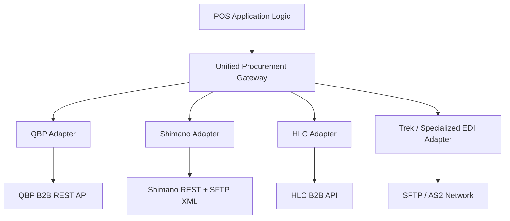

# Distributor Integrations and Adapters

## Unified Gateway Architecture Diagram

The Procurement Module leverages a Unified Gateway using the Adapter Pattern. This architecture intentionally isolates the core point-of-sale and procurement logic from the varying and often volatile interfaces of external distributors.



## Standardized TypeScript Interface

All vendor integrations must conform to the `DistributorAdapter` interface to ensure predictable interaction via the Gateway.

```typescript
// Core Data Types
export interface VendorStockLevel {
  warehouseId: string;
  quantityAvailable: number;
  estimatedArrival?: Date;
}

export interface VendorProductCandidate {
  vendorSku: string;
  upc: string;
  title: string;
  wholesaleCostCents: number;
  msrpCents: number;
  stockLevels: VendorStockLevel[];
}

export interface PurchaseOrderPayload {
  internalPoId: string;
  items: Array<{
    vendorSku: string;
    quantity: number;
  }>;
  shippingMethod?: string;
}

export interface PurchaseOrderAck {
  success: boolean;
  vendorOrderReference?: string;
  estimatedShipDate?: Date;
  errors?: string[];
}

export interface AdvanceShippingNotice {
  vendorOrderReference: string;
  trackingNumber: string;
  carrier: string;
  shippedItems: Array<{
    vendorSku: string;
    quantityShipped: number;
  }>;
}

// Gateway Interface
export interface DistributorAdapter {
  /**
   * Search vendor catalog dynamically based on a query.
   */
  searchCatalog(query: string): Promise<VendorProductCandidate[]>;

  /**
   * Check real-time stock levels for specific SKUs.
   */
  checkStock(vendorSkus: string[]): Promise<Map<string, VendorStockLevel[]>>;

  /**
   * Submit a finalized Purchase Order to the vendor.
   */
  submitPurchaseOrder(payload: PurchaseOrderPayload): Promise<PurchaseOrderAck>;

  /**
   * Fetch Advance Shipping Notice (ASN) / tracking data.
   */
  fetchASN(vendorOrderReference: string): Promise<AdvanceShippingNotice | null>;
}
```

## Protocol Taxonomy for Key Distributors

The backend supports multiple integration paradigms depending on the distributor's technical capabilities:

- **QBP (Quality Bicycle Products):** Integrates via a modern REST B2B API secured by OAuth 2.0. Supports complex multi-warehouse availability queries (e.g., PA, NV, MN, UT).
- **Shimano:** Utilizes a hybrid approach—REST B2B Portal APIs for real-time stock checks, supplemented by scheduled SFTP XML drops for massive catalog updates.
- **HLC & BTI:** Mixed integration utilizing REST B2B APIs for live transactions and XML/CSV feeds for overnight pricing updates.
- **Trek & Specialized:** Legacy enterprise integration using standard EDI ANSI X12 documents (850 Purchase Order, 855 PO Acknowledgment, 856 ASN, 810 Invoice) transmitted securely over SFTP / AS2.
- **NuOrder & Shopify:** Modern integrations using native GraphQL Admin and B2B APIs for synchronized omni-channel inventory and ordering.

## Just-In-Time (JIT) Search Flow

To maintain high performance and expansive catalog access without bloating the local database:

1. **Concurrent Execution:** When a user queries a product, the system concurrently queries the local optimized database and dispatches calls to the unified Gateway.
2. **Streaming Results:** Local results return in `< 50ms`, while vendor API results stream in asynchronously (`< 300ms`).
3. **On-Demand Promotion:** If a user selects a product only available from a vendor feed, that item is instantly "promoted" (imported and mapped) into the local catalog, creating the necessary `vendor_item_mappings`.

## Resiliency Mechanics

Given the unreliability of external B2B APIs, the Gateway employs several resiliency patterns:

- **Circuit Breaker:** If a vendor's API repeatedly fails or times out, the circuit breaker opens, temporarily failing fast to protect local resources, before periodically attempting half-open recovery.
- **Rate Limiting (Token Bucket):** Enforces strict request limits per vendor to prevent API throttling and IP blacklisting.
- **Fallback Interfaces:** In the event of catastrophic API failure, standard CSV import/export endpoints are maintained to allow manual PO submission and catalog updates.